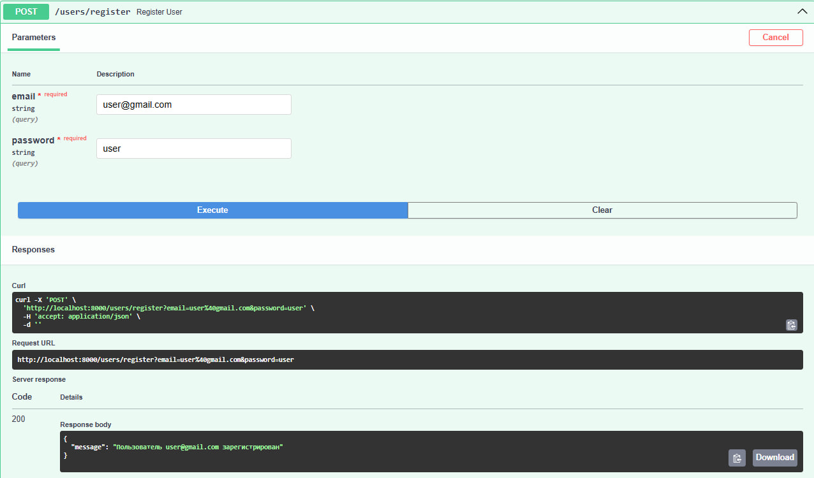
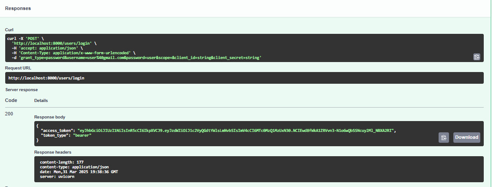
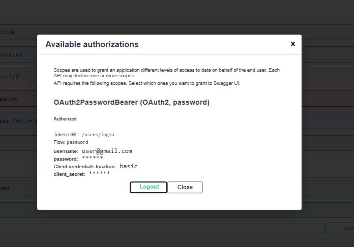
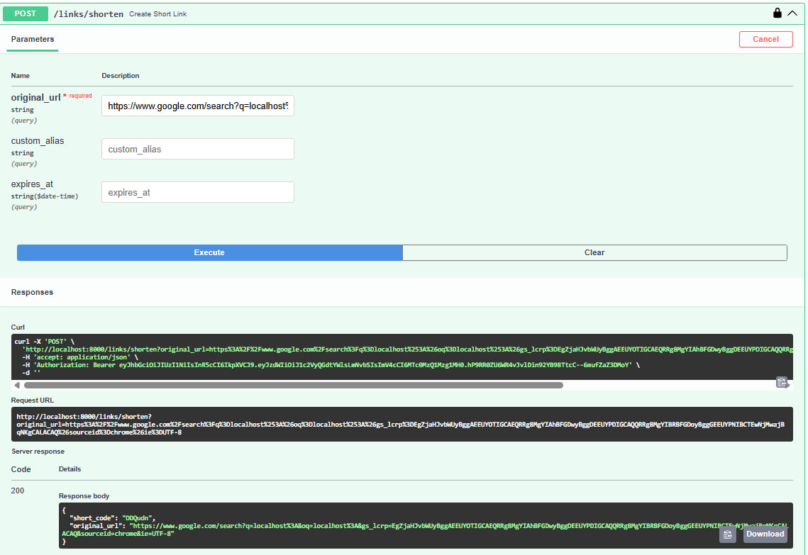
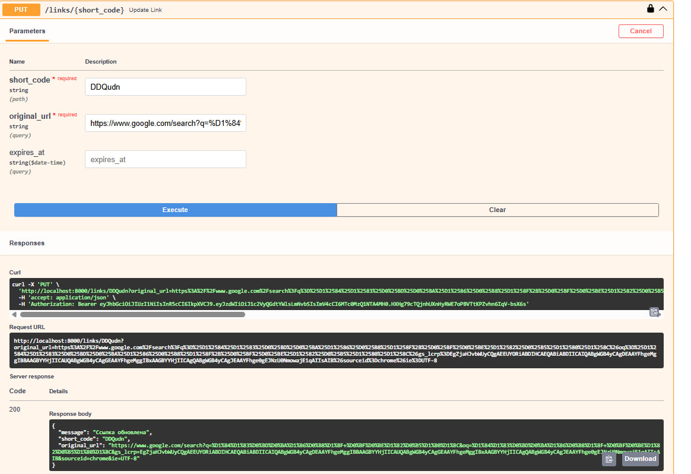
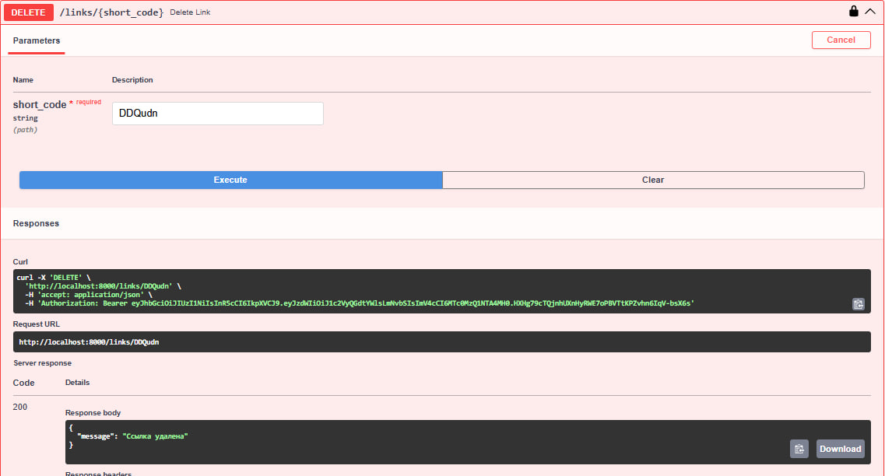
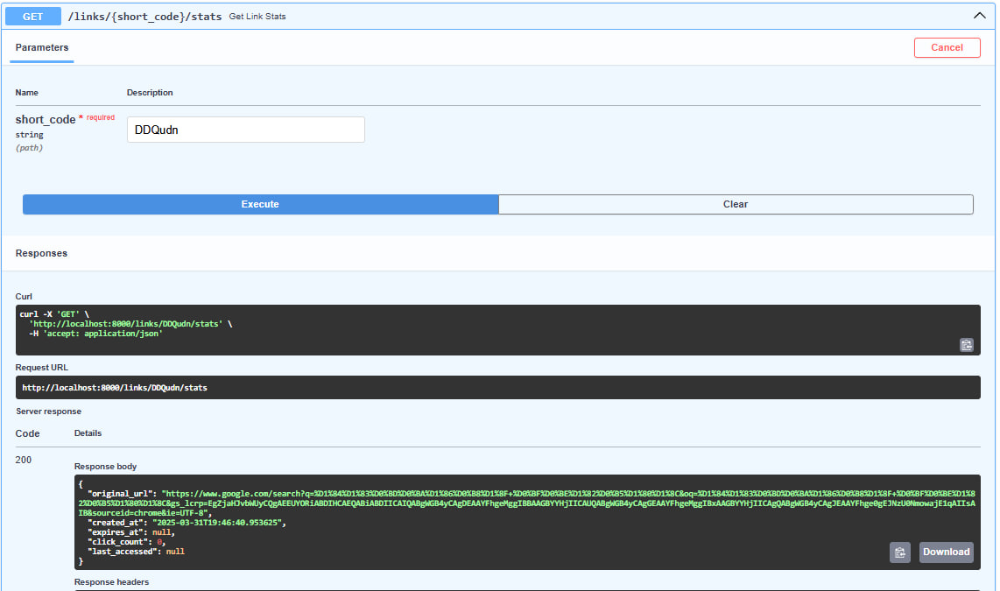
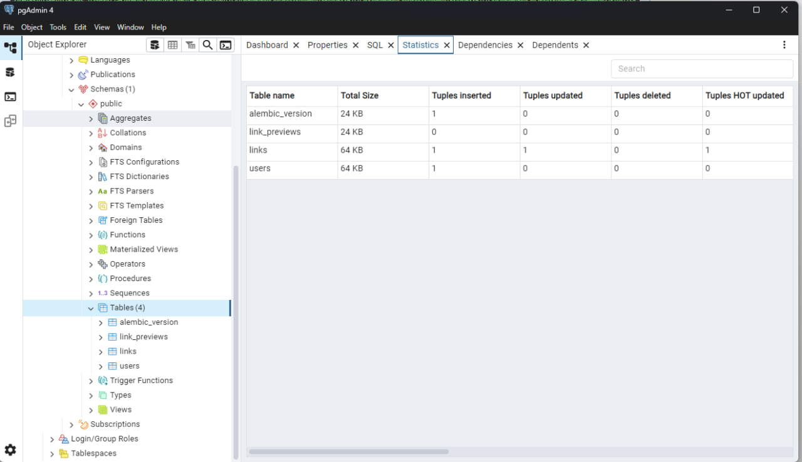
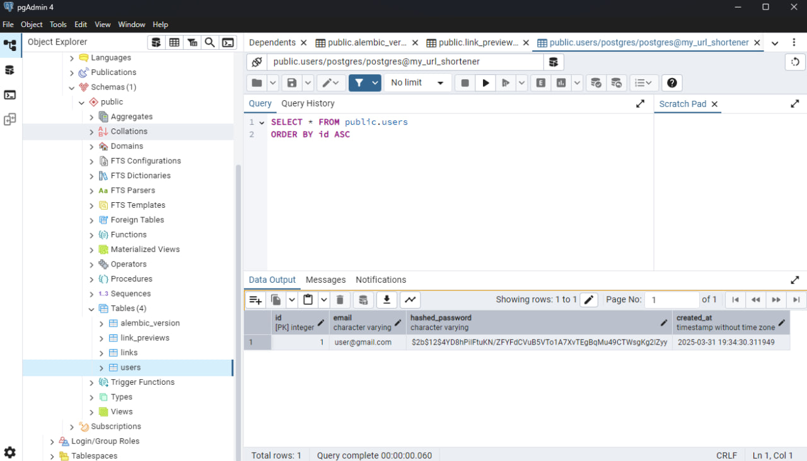
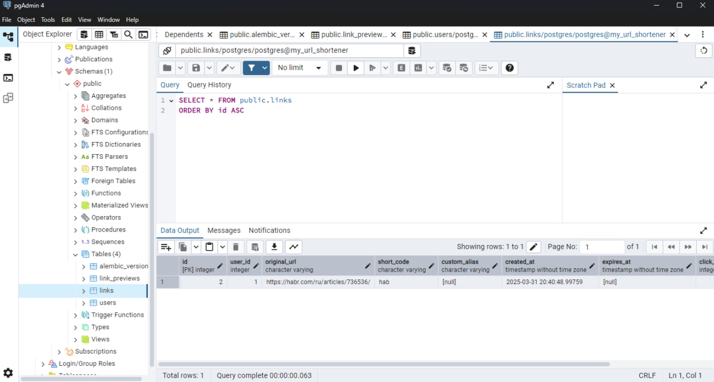

# FastAPI URL Shortener

Сервис сокращения ссылок с поддержкой авторизации, аналитики и предпросмотра. Основан на FastAPI, PostgreSQL, Redis, JWT

---

## Приме функциональности

- **Регистрация и аутентификация пользователей**  
  - **Endpoint:** `POST /users/register` и `POST /users/login`  
  - **Описание:** Регистрация нового пользователя с хешированием пароля, аутентификация и получение JWT-токена.  
  - 
  - 
  - 

- **Создание короткой ссылки**  
  - **Endpoint:** `POST /links/shorten`  
  - **Описание:** Принимает длинный URL (и опционально кастомный alias, время жизни) и возвращает сгенерированный короткий код.  
  - 

  - **Обновление и удаление ссылки**  
  - **Endpoint:** `PUT /links/{short_code}` и `DELETE /links/{short_code}`  
  - **Описание:** Позволяют обновить параметры ссылки (например, продлить время жизни) или удалить её (доступно для зарегистрированного пользователя).  
  - 
  - 


- **Получение статистики ссылки**  
  - **Endpoint:** `GET /links/{short_code}/stats`  
  - **Описание:** Возвращает информацию о ссылке: оригинальный URL, дату создания, количество переходов, дату последнего перехода.  
  - 


---

## Структура базы данных

Проект использует PostgreSQL для хранения данных. Структура базы данных выглядит следующим образом:

- 

- **Таблица `users`:**  
  - `id` (Integer, Primary Key)  
  - `username` (String, уникальный)  
  - `email` (String, уникальный, если добавите)  
  - `password_hash` (String)  
  - 

- **Таблица `links`:**  
  - `id` (Integer, Primary Key)  
  - `original_url` (String)  
  - `short_code` (String, уникальный)  
  - `user_id` (Integer, Foreign Key на `users.id`, может быть NULL для незарегистрированных пользователей)  
  - `created_at` (DateTime)  
  - `expires_at` (DateTime, опционально)  
  - `click_count` (Integer, по умолчанию 0)  
  - `last_clicked` (DateTime, опционально)
  - 


- **Таблица `link_previews`:**  
  - `id` (Integer, Primary Key)  
  - Другие поля для хранения метаданных (например, заголовок, описание, изображение)  

- **Таблица `alembic_version`:**  
  - Таблица для отслеживания применённых миграций

---

## Установка и запуск

### Локальный запуск с Docker

1. **Клонируйте репозиторий:**

   ```bash
   git clone <URL_вашего_репозитория>
   cd FastAPI_url_shortener
   ```

2. **Создайте файл `.env` в корне проекта (если ещё не создан) и задайте переменные окружения:**

   ```ini
   DATABASE_URL=postgresql+psycopg2://postgres:postgres@db:5432/postgres
   REDIS_URL=redis://redis:6379
   SECRET_KEY=some-secret-key
   JWT_ALGORITHM=HS256
   JWT_EXPIRE_MINUTES=60
   ```

3. **Соберите образы и запустите контейнеры:**

   ```bash
   docker-compose build
   docker-compose up -d
   ```

4. **Проверьте, что контейнеры запущены:**

   ```bash
   docker-compose ps
   ```

5. **Примените миграции Alembic:**

   ```bash
   docker-compose exec web alembic revision --autogenerate -m "initial"
   docker-compose exec web alembic upgrade head
   ```

6. **Откройте Swagger-документацию:**  
   Перейдите в браузере по адресу http://localhost:8000/docs

### Остановка контейнеров

Чтобы остановить и удалить контейнеры (но сохранить данные томов):

```bash
docker-compose down
```

Если хотите удалить и тома, чтобы очистить базу:

```bash
docker-compose down -v
```

---

## API Документация

После запуска приложения перейдите по адресу http://localhost:8000/docs, чтобы увидеть автоматически сгенерированную документацию Swagger. Здесь описаны все эндпоинты, входные параметры и ответы.

Для каждого эндпоинта предусмотрено место для прикрепления ссылки на скриншот, демонстрирующий работу функционала

---

## Деплой

Проект можно деплоить на любой сервер с поддержкой Docker

---

## Что можно улучшить в дальнейшем

- Использовать UUID вместо Integer ID
- Добавить полноценные Pydantic схемы (BaseModel) для запросов и ответов
- Сделать группировку ссылок по проектам
- Сделать web-интерфейс или телеграм-бота
- Ограничить количество ссылок у незарегистрированных пользователей
- Добавить фоновую задачу для удаления "просроченных" ссылок
